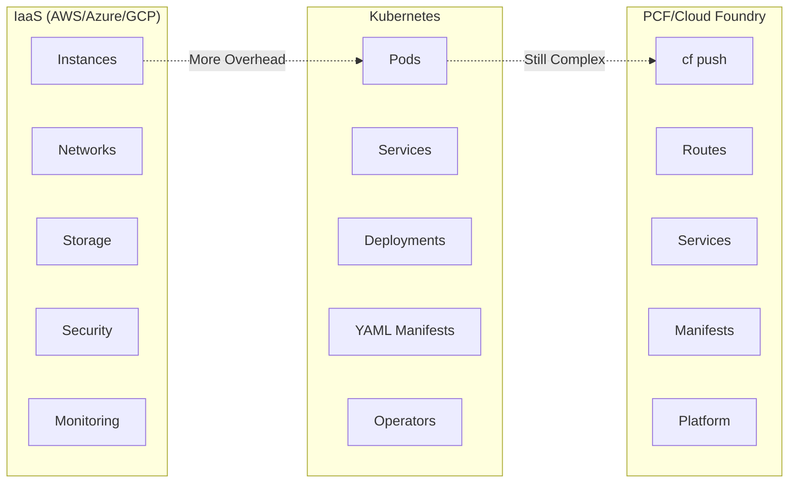

# PCF Overview

## What is Pivotal Cloud Foundry?

Pivotal Cloud Foundry (PCF) is an **application-centric platform-as-a-service (PaaS)** built on Cloud Foundry open source. It abstracts away infrastructure complexity so you can focus on delivering applications.

Think of it this way:
- **Cloud IaaS (AWS/Azure/GCP)**: You manage instances, networking, storage, security groups, load balancers
- **Kubernetes**: You manage pods, services, deployments, YAML manifests, cluster autoscaling
- **PCF**: You `cf push` your app. Done.

## Core Value Proposition

### For Developers
- Deploy apps without thinking about infrastructure
- Automatic scaling, health checks, logging
- One command deployment: `cf push`
- Consistent experience across environments

### For Operations
- Automated deployments and updates
- Built-in security, RBAC, networking
- Centralized monitoring and logging
- Self-healing infrastructure

### For Organizations
- Reduced operational overhead
- Faster time to market
- Platform as a product (internal or external)
- Multi-tenancy out of the box

## PCF vs Traditional Approaches

## Key PCF Concepts

### Applications (Apps)
- Your deployable unit (stateless by design)
- Automatically containerized from source code
- Instances scale from 1 to thousands

### Buildpacks
- Automatically detect app language/framework
- Compile dependencies and build artifacts
- Transform source code → runnable container

### Services
- Managed data stores (databases, caches, messaging)
- Provisioned on-demand via service broker
- Automatically bound to apps via environment variables

### Routes & Domains
- Built-in load balancing and routing
- Multiple routes per app for A/B testing
- Blue-green deployments built-in

### Spaces & Orgs
- Multi-tenancy organization structure
- RBAC at organization and space level
- Quota management per org/space

## cf4k8s: PCF on Kubernetes

**cf4k8s** is the latest Cloud Foundry distribution running on Kubernetes.

Why cf4k8s?
- Leverage Kubernetes infrastructure
- All PCF benefits on any K8s cluster
- Cloud-native architecture
- Perfect for local learning

This guide uses cf4k8s for hands-on practice.

## When to Use PCF

### Good Fit ✅
- Teams want rapid app deployment without infrastructure knowledge
- Organizations need multi-tenant SaaS platform
- Internal platform team building developer experience
- Apps that need autoscaling and zero-downtime deployments
- Microservices with service discovery and binding

### Consider Alternatives ⚠️
- Heavy infrastructure customization needed
- Specialized compute (GPU, custom networking)
- Very cost-sensitive (bare metal might be cheaper)
- Teams prefer managing everything (possible with K8s)

## How This Guide Helps

This is a practical learning path designed specifically for you:

1. **You already know cloud** → We skip basics, focus on what makes PCF unique
2. **You want hands-on experience** → 6 progressive labs with cf4k8s
3. **You want comparisons** → Detailed PCF vs AWS/Azure/GCP sections
4. **You want local setup** → Complete cf4k8s setup for your machine

---

Next: [Why Choose PCF?](02-why-pcf.md)
