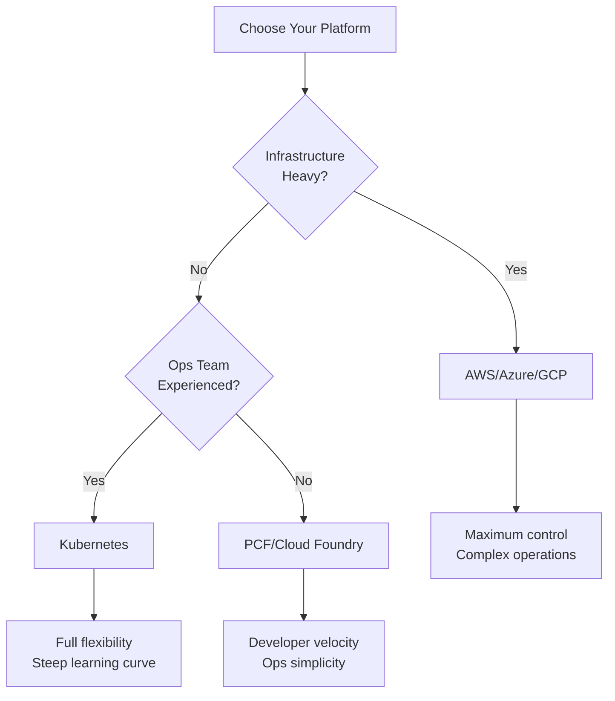

# Why Choose PCF?

## Strategic Advantages Over Other Platforms

### vs AWS/Azure/GCP (IaaS)

#### Operational Efficiency
| Aspect | IaaS | PCF |
|--------|------|-----|
| Deployment | 30+ API calls, infrastructure setup | `cf push` |
| Scaling | Design ASGs, configure policies | Automatic based on app metrics |
| Networking | Manage VPCs, security groups, ALBs | Routes and load balancing built-in |
| Monitoring | Integrate external tools | Built-in metrics and logging |
| Ops Team | Large (infrastructure engineers) | Smaller (platform engineers) |

#### Developer Experience
- **IaaS**: "Here's a VM, manage it yourself"
- **PCF**: "Here's your deployed app with autoscaling, logging, and monitoring"

### vs Kubernetes (Container Platform)

#### Simplicity for App Developers
| Aspect | Kubernetes | PCF |
|--------|-----------|-----|
| Deployment | Write YAML manifests | `cf push` |
| Configuration | ConfigMaps, Secrets, Operators | Environment variables, services |
| Scaling | HPA, VPA, KEDA, custom operators | Automatic based on CPU/memory |
| Networking | Services, Ingress, NetworkPolicies | Routes (load balanced by default) |
| Expertise | 6-12 month learning curve | Days to weeks |

#### Platform Abstraction
- **Kubernetes**: "Manage your orchestration"
- **PCF**: "Focus on your application logic"

## Unique PCF Capabilities

### 1. **Buildpacks: Convention Over Configuration**

```bash
$ cf push my-app
Detecting buildpack... Ruby detected!
→ Installing Ruby 3.1.0
→ Installing gems from Gemfile
→ Running build pack
→ Starting app...
```

No Dockerfile. No build scripts. Just source code.

### 2. **Service Broker Architecture**

Any stateful system can be a service:
- Databases (PostgreSQL, MySQL, MongoDB)
- Caches (Redis, Memcached)
- Message queues (RabbitMQ, Kafka)
- SaaS (SendGrid, New Relic, etc.)

```bash
$ cf create-service postgres 10gb my-db
$ cf bind-service my-app my-db
$ cf restage my-app
# App automatically receives DB_URL environment variable
```

### 3. **Blue-Green Deployments by Default**

```bash
$ cf push my-app --version 2
# Version 2 deployed to new instances
# Route exists for both versions

$ cf map-route my-app-v2 my-domain
# Traffic gradually or completely switches
```

Zero-downtime deployments built into the platform.

### 4. **Application-Centric Model**

Think in terms of:
- Applications (not instances)
- Services (not infrastructure)
- Routes (not load balancers)
- Spaces (not namespaces)

Less plumbing, more app development.

## Real-World Use Cases

### Internal Developer Platform
Organizations build internal PCF clouds where developers deploy without infrastructure knowledge.

**Example**: Uber's internal platform (pre-Kubernetes)

### SaaS Platforms
Multi-tenant applications where each customer gets their own space.

**Example**: Heroku (built on CF), Cloud.gov (US Government), IBM Cloud Foundry

### Rapid Experimentation
Teams that need fast deployment cycles without infrastructure overhead.

**Example**: Startups, innovation centers

### Microservices Mesh
Services that need service discovery, routing, and automatic scaling.

**Example**: Enterprises with dozens of microservices

## Comparison Matrix



## When NOT to Use PCF

### Consider Alternatives If:
- ❌ You need GPU/specialized compute
- ❌ You have stateful workloads that don't fit service pattern
- ❌ You need custom kernel modules or very low-level control
- ❌ Your team already knows Kubernetes well
- ❌ Cost is primary driver (IaaS can be cheaper at scale)

## Key Insight for Advanced Developers

**PCF trades flexibility for velocity.**

You give up some control (can't customize everything), but gain:
- 70% faster time to production
- 80% less operational overhead
- 90% fewer deployment failures

**This is intentional and a feature, not a limitation.**

---

Next: [Learning Path](03-learning-path.md)
