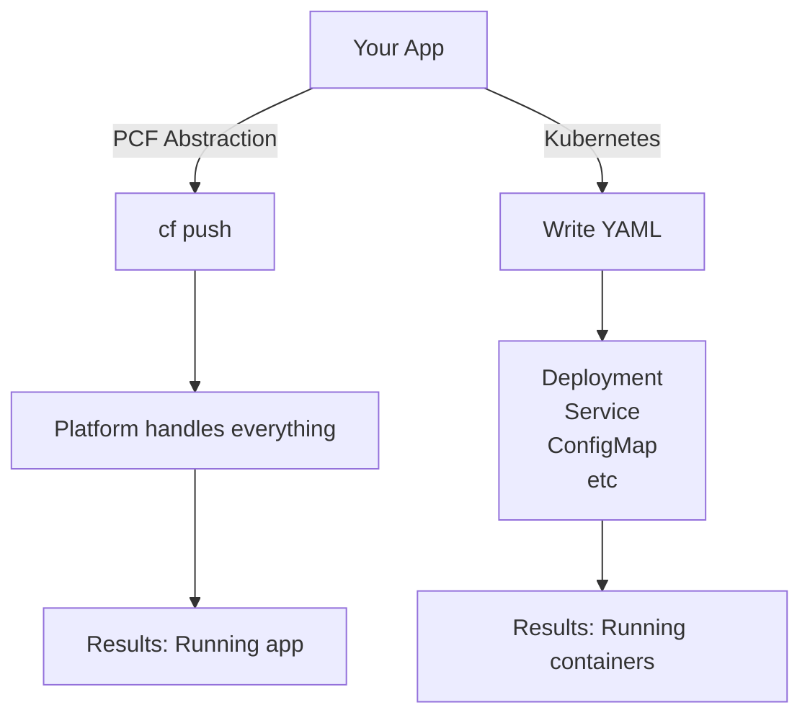

# Container Orchestration in PaaS Context

## How PCF Relates to Kubernetes

### Kubernetes: Container Orchestrator

Kubernetes is the system that:
- Schedules containers on nodes
- Manages networking between containers
- Handles storage volumes
- Implements service discovery
- Provides autoscaling

You describe desired state → Kubernetes makes it happen.

### PCF: Application Platform

PCF runs **on top of** Kubernetes (in cf4k8s) or **implements similar** orchestration concepts:
- Schedules applications on infrastructure
- Manages networking through routes
- Binds services to applications
- Implements service discovery through service brokers
- Provides autoscaling

You deploy applications → PCF (using Kubernetes) makes it happen.

## Conceptual Mapping

| Kubernetes Concept | PCF Equivalent | Purpose |
|-------------------|-----------------|---------|
| Pod | Container/Instance | Smallest deployable unit |
| Deployment | Application | Manage replicas |
| Service | Route | Network access |
| Namespace | Organization/Space | Multi-tenancy |
| ConfigMap | Environment variables | App configuration |
| Secret | Credentials/Service binding | Sensitive data |
| Ingress | Route | External access |
| StatefulSet | Service backing resource | Stateful workloads |

## Key Difference: Abstraction Level



### PCF: Higher Abstraction
- Less control, but less complexity
- Conventions over configuration
- Built-in opinions (good defaults)
- Faster time to production

### Kubernetes: Lower Abstraction
- Full flexibility and control
- Configuration-heavy
- You build the opinions
- Longer time to production

## Why cf4k8s?

cf4k8s runs Cloud Foundry on Kubernetes, giving you:

- **Best of both worlds**: PCF developer experience + Kubernetes infrastructure
- **Multi-cloud**: Run on any Kubernetes cluster
- **Local development**: Run on Kind or Docker Desktop
- **Enterprise ready**: Use existing Kubernetes infrastructure

```
cf4k8s = Cloud Foundry abstractions + Kubernetes orchestration
```

## Container Concepts Remain the Same

Regardless of IaaS/Kubernetes/PCF:

- Applications run in containers
- Containers are stateless (preferably)
- Data lives in services (databases, caches)
- Horizontal scaling by running copies
- Health checks determine restart policy
- Networking is critical

## For Your Learning

Since you know Kubernetes or container concepts:

1. ✅ Skip container basics
2. ✅ Focus on **PCF-specific abstractions**
3. ✅ Understand **why** PCF makes different choices
4. ✅ Learn **when to use** PCF vs bare Kubernetes

---

Next: [PaaS Model](03-paas.md)
