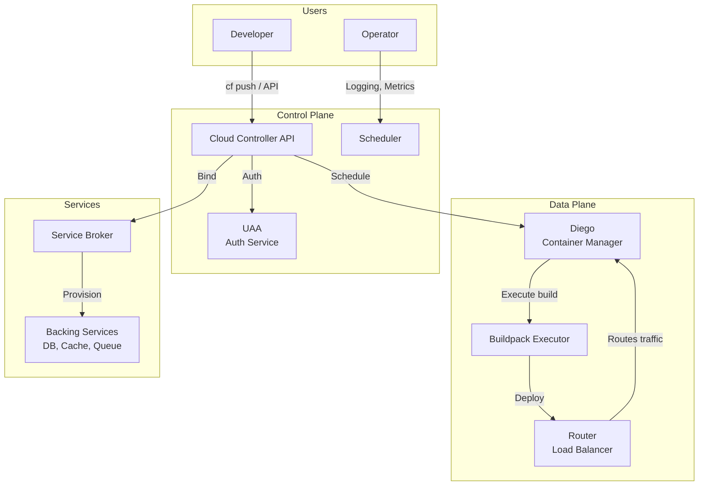
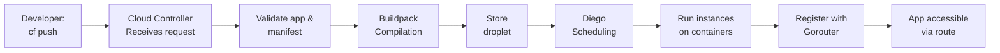

# PCF Architecture

## High-Level Architecture



## Core Components

### 1. Cloud Controller (CC)
**The brain of PCF**

- Receives `cf push` commands
- Validates applications and manifests
- Manages application lifecycle
- Stores application, org, space data
- Coordinates with other components

**CLI Communication:**
```bash
$ cf push my-app
→ Contacts Cloud Controller API
→ Authenticates with UAA
→ Validates manifest
→ Schedules deployment
```

### 2. Diego
**Application scheduling and management**

- Decides where to run containers
- Manages container lifecycle
- Implements health checking
- Handles app restarts
- Manages app instances

### 3. Router (Gorouter)
**Traffic routing and load balancing**

- Receives HTTP requests
- Routes to application instances
- Implements round-robin balancing
- Supports sticky sessions
- Monitors instance health

```
HTTP Request → Gorouter (Identifies route) → 
Load balances to available instances → 
Response to client
```

### 4. UAA (User Account and Authentication)
**Identity and access management**

- Authenticates users (developers, operators)
- Generates OAuth tokens
- Manages user roles and permissions
- Integrates with external identity providers (LDAP, SAML)

### 5. Buildpacks
**Source code to running container**

Process:
1. Detect: Identify language/framework
2. Build: Compile, install dependencies, optimize
3. Release: Prepare container runtime

**Example Ruby buildpack:**
```
app/ (your source code)
  ↓
Buildpack detects: Ruby
  ↓
Installs: Ruby runtime, Bundler
  ↓
Runs: bundle install
  ↓
Creates: Container with compiled app
```

### 6. Service Broker
**provision and manage services**

- Providers interface (PostgreSQL, Redis, etc.)
- Manages credentials and access
- Handles service binding/unbinding
- Implements open service broker API

## Application Deployment Flow



## Multi-Tenancy Structure

```
┌─ PCF Foundation ────────────────────┐
│                                     │
│  ┌─ Organization: Acme Corp ─────┐ │
│  │                                 │ │
│  │  ┌─ Space: Production ────────┐ │ │
│  │  │  • my-api (3 instances)    │ │ │
│  │  │  • my-web (5 instances)    │ │ │
│  │  │  • my-db (service)         │ │ │
│  │  └─────────────────────────────┘ │
│  │                                 │ │
│  │  ┌─ Space: Development ──────┐ │ │
│  │  │  • my-api (1 instance)    │ │ │
│  │  │  • my-test (2 instances)  │ │ │
│  │  └─────────────────────────────┘ │
│  │                                 │
│  └─────────────────────────────────┘ │
│                                     │
│  ┌─ Organization: Beta Startup ──┐ │
│  │  ┌─ Space: Alpha ───────────┐ │ │
│  │  │  • app-v1 (1 instance)   │ │ │
│  │  └─────────────────────────────┘ │
│  └─────────────────────────────────┘ │
│                                     │
└─────────────────────────────────────┘
```

### Organizations
- Top-level multi-tenancy boundary
- Users have roles: Manager, Auditor, Billing Manager
- Quota limits (memory, routes, services)

### Spaces
- Within organization
- Logical application grouping (production, staging, dev)
- Users have roles: Manager, Developer, Auditor
- Inherit org quotas (can be further restricted)

## Key Concepts

### Applications (Apps)
- Deployable units (stateless by design)
- Language/framework agnostic
- Multiple instances for HA
- Automatically containerized via buildpack

### Routes
- URL endpoint for applications
- Multiple routes can point to same app (A/B testing)
- Load balanced by Gorouter
- Support for blue-green deployments

### Instances
- Running copy of your application
- Containerized
- Auto-restart on failure
- Scale horizontally

### Services
- Provisioned backing services
- Database, cache, queue, etc.
- Credentials injected to bound apps
- Managed lifecycle (create, bind, unbind, delete)

## Data Flow Example

**User requests deployed app:**

```
1. User hits: https://my-app.example.com/api
2. DNS resolves to Gorouter IP
3. Gorouter looks up route: my-app.example.com → targets
4. Diego provides list of running instances
5. Gorouter picks one instance (round-robin)
6. Request go to: instance-ip:8080/api
7. App responds
8. Response returned to user
```

## Resilience & Failure Handling

### Diego Container Manager
- Monitors app instances
- Runs health checks
- Automatically restarts crashed instances
- Rebalances instances on infrastructure failure

### Gorouter Health Checks
- Removes failed instances from routing
- Stops sending requests to unhealthy instances
- Allows graceful recovery

### Application Scaling
- Specify desired instances: `cf scale my-app -i 5`
- Diego schedules requested replicas
- Gorouter load balances across instances

---

Next: [Apps and Buildpacks](02-apps-buildpacks.md)
