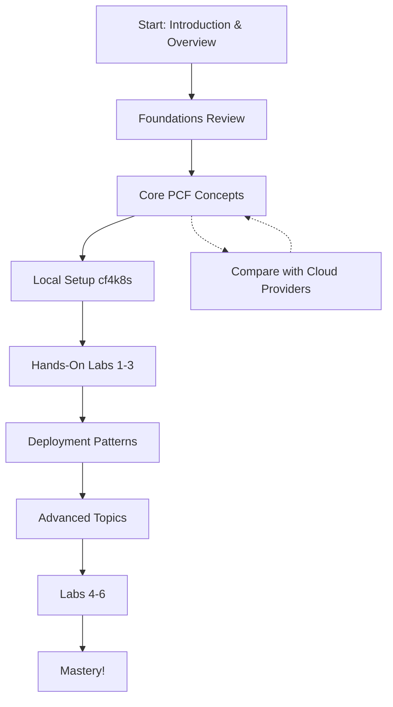

# Welcome to PCF Learning Hub

Master Pivotal Cloud Foundry and cf4k8s with this comprehensive hands-on learning guide designed for advanced cloud developers.

## Why This Guide?

You're an advanced cloud developer. You understand AWS, Azure, GCP. You know containers, orchestration, PaaS models.

**But PCF is different.**

This guide isn't about teaching you cloud basics—it's about showing you how PCF approaches the platform layer differently, what unique value it brings, and how to leverage it locally with cf4k8s.

## What You'll Learn

- **PCF Architecture**: How Cloud Foundry structures applications, services, and infrastructure
- **Real Deployment Patterns**: Blue-green deployments, canary releases, service discovery
- **PCF vs Others**: Strategic differences between PCF and AWS/Azure/GCP
- **Hands-On Experience**: 6 progressive labs using cf4k8s locally
- **Production Patterns**: Security, monitoring, scaling, and resource management

## Quick Navigation

=== "New to PCF?"
    Start here: [Introduction](00-introduction/01-overview.md) → [Learning Path](00-introduction/03-learning-path.md)

=== "Coming from AWS/Azure/GCP?"
    Jump to: [PCF vs Cloud Providers](07-pcf-vs-cloud-providers/04-comparison-matrix.md)

=== "Ready to Code?"
    Start labs: [Lab 1: Deploy First App](06-labs/01-deploy-first-app.md)

=== "Need Setup Help?"
    Follow: [Local Setup Guide](03-setup-local/01-prerequisites.md)

## Learning Path Overview

## Progressive Labs

| Lab | Topic | Concepts | Difficulty |
|-----|-------|----------|-----------|
| 1 | Deploy Your First App | Applications, manifests, push model | Beginner |
| 2 | Scaling & Availability | Instances, auto-scaling, health checks | Beginner |
| 3 | Service Binding | Services, credentials, bindings | Intermediate |
| 4 | Blue-Green Deployment | Zero-downtime deployments, routing | Intermediate |
| 5 | Custom Buildpack | Build process, buildpack creation | Advanced |
| 6 | Monitoring & Logging | Observability, logging, metrics | Advanced |

## Key Insights for Advanced Developers

### What Makes PCF Different?

- **App-Centric Model**: PCF is centered around applications, not infrastructure
- **Buildpacks**: Intelligent build process vs. container image building
- **Services First**: Built-in service broker architecture for stateful systems
- **Developer Experience**: Reduced operational overhead through conventions
- **Blue-Green Native**: Deployment patterns built into the platform

### Common Questions Answered

- [How does PCF handle deployments differently than Kubernetes?](07-pcf-vs-cloud-providers/04-comparison-matrix.md)
- [When should I choose PCF over AWS/Azure/GCP?](00-introduction/02-why-pcf.md)
- [How do services work in PCF?](02-core-concepts/03-services.md)

## Getting Started Now

### Prerequisites Check
- ✅ Docker installed
- ✅ kubectl ready
- ✅ Cloud computing knowledge
- ✅ ~2-3 hours for complete learning path

### Next Steps
1. Review [Learning Path](00-introduction/03-learning-path.md) (5 min)
2. Set up [Local cf4k8s](03-setup-local/01-prerequisites.md) (30 min)
3. Complete [Lab 1](06-labs/01-deploy-first-app.md) (30 min)
4. Explore [Core Concepts](02-core-concepts/01-architecture.md) (60 min)
5. Work through remaining labs at your pace

## Resources

- [Cloud Foundry Documentation](https://docs.cloudfoundry.org/)
- [cf4k8s Repository](https://github.com/cloudfoundry/cf-for-k8s)
- [Buildpacks Documentation](https://buildpacks.io/)
- [CF CLI Reference](https://cli.cloudfoundry.org/)

---

**Ready?** → [Start with Introduction](00-introduction/01-overview.md)
